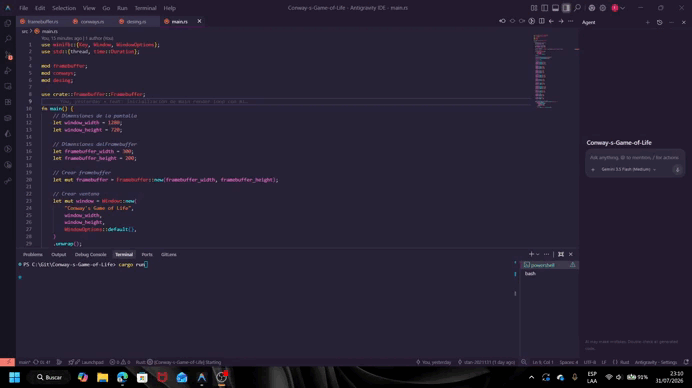

# Conway's Game of Life

Implementación del **Juego de la Vida de Conway (Conway's Game of Life)** en **Rust**, desarrollada para el curso de **Gráficas por Computadora**.

## Descripción

Este proyecto implementa el algoritmo de Conway utilizando un **framebuffer** como tablero de simulación. Cada píxel representa una célula que puede encontrarse en uno de dos estados:

* **Viva**
* **Muerta**

La simulación se actualiza en tiempo real siguiendo las reglas clásicas del Juego de la Vida y se renderiza utilizando la librería **minifb**.

## Características

* Implementación del algoritmo completo del Juego de la Vida.
* Framebuffer de resolución independiente de la ventana.
* Conteo de vecinos para cada célula.
* Actualización por generaciones utilizando un buffer temporal.
* Renderizado en tiempo real.
* Velocidad de simulación controlada mediante un pequeño retraso entre generaciones.
* Implementación de múltiples patrones clásicos.

## Reglas del Juego

En cada generación se aplican las siguientes reglas:

1. Una célula viva con menos de **dos vecinos vivos** muere por **soledad**.
2. Una célula viva con **dos o tres vecinos vivos** sobrevive.
3. Una célula viva con más de **tres vecinos vivos** muere por **sobrepoblación**.
4. Una célula muerta con exactamente **tres vecinos vivos** revive.

## Implementación

El proyecto está dividido en tres módulos principales:

### `framebuffer.rs`

Contiene la estructura `Framebuffer` y las operaciones básicas sobre el tablero:

* Creación del framebuffer.
* Limpieza del buffer.
* Dibujado de píxeles mediante `point()`.
* Lectura y escritura de celdas.
* Configuración de colores.

### `conways.rs`

Implementa la lógica del Juego de la Vida:

* Conteo de vecinos (`get_neighbors()`).
* Cálculo de la siguiente generación (`update()`).
* Uso de un buffer temporal para evitar modificar el estado actual durante el recorrido.

### `desing.rs`

Contiene funciones para crear distintos organismos y patrones clásicos del Juego de la Vida.

## Patrones implementados

Actualmente la simulación incluye los siguientes patrones:

* Blinker
* Boat
* Tub
* Glider
* Heavy Weight Spaceship (HWSS)
* Pulsar
* Clock
* Bunnies
* Garden of Eden (GoE)
* Gosper Glider Gun

Cada patrón se implementó como una función independiente que recibe la posición inicial donde será dibujado.

## Ejecución

Clonar el repositorio:

```bash
git clone <url-del-repositorio>
cd Conway-s-Game-of-Life
```

Ejecutar:

```bash
cargo run
```

## Tecnologías utilizadas

* Rust
* Cargo
* minifb

## Resultado

La simulación inicia con múltiples organismos distribuidos a lo largo del tablero para producir una evolución variada y demostrar distintos comportamientos como:

* Osciladores.
* Naves espaciales.
* Generadores de gliders.
* Patrones estables.
* Patrones con crecimiento continuo.

## Demostración

A continuación se muestra una ejecución del proyecto:

**GIF de la simulación**



## Autor

**Sergio Estuardo Tan Coromac**

Proyecto desarrollado para el curso de **Gráficas por Computadora**.
